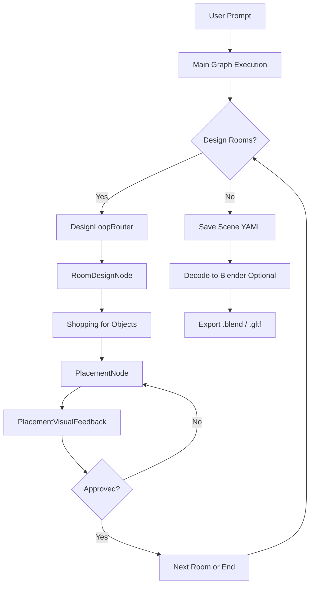
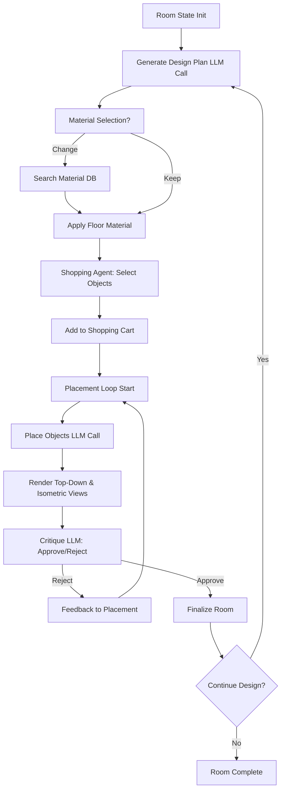
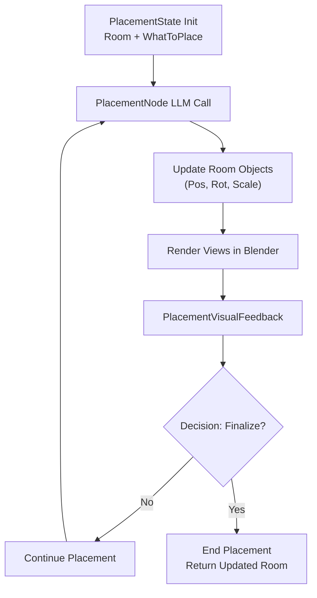
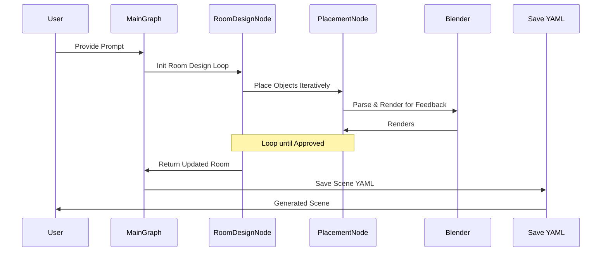

# SceneBuilder System Diagrams and Descriptions

This document provides an overview of the SceneBuilder system's architecture, workflows, and key components. SceneBuilder is an AI-driven tool for generating 3D scenes from natural language prompts, leveraging Pydantic models, LLM agents, and Blender integration. The system operates through modular graphs and nodes that handle planning, object selection, placement, and visualization.

## Overall System Architecture

The high-level flow starts with a user prompt, processes it through AI agents and graphs to generate a scene definition (YAML), and optionally decodes it into Blender for rendering/export.

### Mermaid Flowchart: Main Generation Workflow

**Description**: 
- The `main_graph` orchestrates scene generation by iterating over rooms via `DesignLoopRouter`.
- Each room undergoes design (planning, object selection, placement) until complete.
- Output is a YAML scene definition, which can be decoded into Blender scenes.

## Room Design Workflow

The room design process involves iterative refinement: planning the room, selecting objects (shopping), placing them, and critiquing via visual feedback.

### Mermaid Flowchart: Room Design Process

**Description**:
- `RoomDesignNode` manages the loop: Initial plan generation, material tweaks, object shopping, and iterative placement with visual critique.
- Uses `room_design_agent` for LLM decisions, integrated with tools for database queries.
- Termination based on run count, early config, or explicit completion signal.

## Placement Workflow

Placement focuses on positioning objects within a room, with visual feedback for refinement.

### Mermaid Flowchart: Placement Process

**Description**:
- `PlacementNode` uses `placement_agent` to compute transformations for objects.
- `PlacementVisualFeedback` generates renders and appends to history for context.
- Loops until the agent decides to finalize (via `KeepEditingOrFinalize`).

## Key Components Table

| Component | Type | Description | Key Files/Imports | Inputs | Outputs |
|-----------|------|-------------|-------------------|--------|---------|
| **MainState** | Pydantic Model | Central state for scene generation, tracks prompt, scene, messages, room index. | `states.py` | User prompt | Scene definition |
| **RoomDesignState** | Pydantic Model | State for room-level design: room, plan, shopping cart, history. | `states.py` | Room init, plan | Updated Room |
| **PlacementState** | Pydantic Model | State for object placement: room, plan, item to place, history. | `states.py` | Room, ObjectBlueprint | Updated Room |
| **RoomDesignNode** | Graph Node | Orchestrates room design loop: planning, shopping, placement, critique. | `design.py` | RoomDesignState | Room or End[Room] |
| **PlacementNode** | Graph Node | Computes positions/rotations/scales for objects using LLM. | `placement.py` | PlacementState | Updated Room or End[Room] |
| **DesignLoopRouter** | Graph Node | Manages iteration over multiple rooms in a scene. | `design.py` | MainState | Scene or End[Scene] |
| **PlacementVisualFeedback** | Graph Node | Generates Blender renders for feedback loop. | `placement.py` | PlacementState | Next Node Trigger |
| **room_design_agent** | LLM Agent | Handles design decisions, tool calls for shopping/materials. | `agents.py` (inferred) | Prompts, state | Plans, Actions, Objects |
| **placement_agent** | LLM Agent | Focuses on spatial placement reasoning. | `agents.py` (inferred) | State, renders | PlacementAction |
| **main_graph** | Pydantic Graph | Top-level workflow graph combining design and placement. | `graphs.py` | MainState | Final Scene |
| **room_design_graph** | Pydantic Graph | Subgraph for single room design. | `design.py` | Room | Updated Room |
| **placement_graph** | Pydantic Graph | Subgraph for object placement iterations. | `placement.py` | PlacementState | Updated Room |
| **ObjectDatabase** | DB Client | Interfaces with Graphics-DB for assets/materials. | `database/object.py` | Queries | Assets, Blueprints |
| **Blender Decoder** | Module | Parses YAML to Blender scenes, handles rendering/export. | `decoder/blender.py` | Scene/Room YAML | .blend / .gltf files |

## Data Flow: Sequence Diagram

### Mermaid Sequence Diagram: Prompt to Scene Generation

**Description**:
- Asynchronous graph execution (`asyncio.run(main_graph.run())`) drives the flow.
- States propagate data (e.g., `Room` models with objects' positions).
- Visual feedback uses Blender renders converted to binary for LLM input.
- Decode tools (e.g., `decode_room`) handle post-generation rendering/export separately.

## Theory of Operation

### Core Principles
- **Modular Graphs**: Uses `pydantic_graph` for composable workflows, allowing subgraphs (e.g., placement) within larger ones (e.g., room design).
- **Agent-Driven Decisions**: LLMs (via `pydantic_ai`) act as agents with tools for DB queries, generating structured outputs (Pydantic models).
- **Iterative Refinement**: Loops with visual feedback mimic human design: plan → act → critique → refine.
- **Blender Integration**: YAML definitions are parsed into Blender scenes for visualization and export; supports .blend, .gltf/.glb.
- **State Management**: Pydantic models ensure type-safe data flow; extras like `message_history` track LLM context.
- **Termination**: Controlled by config (e.g., `terminate_early`), run counts, or agent decisions (`complete=True`).

### Limitations & Notes
- Current implementation focuses on single-room scenes; multi-room expansion via loop.
- Debug mode uses mocks; production relies on local VLLM/Graphics-DB.
- Visual feedback is binary-encoded for LLM input, enabling image-conditioned reasoning.
- Shopping cart prevents duplicates but assumes quantity=1; future enhancements could add multi-instance support.

For implementation details, refer to source files like `main.py`, `nodes/design.py`, and `workflow/graphs.py`.