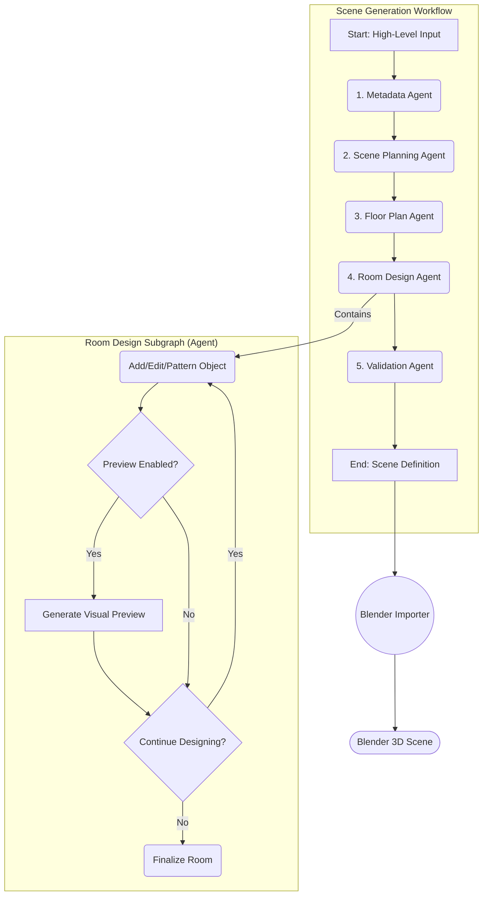

<blockquote>
I would like to create a system that creates 3D scenes by utilizing vision-language models and agentic AI workflows. Tentatively, here is my design plan:
1) A human-readable plain text representation will serve as the data representation of scene definition. (This likely has to be a structured language format. I am split between different options, but YAML is a very strong contender.)
2) Given diverse combinations of high-level inputs (like scene category, characteristics, and design intentions), AI agents first scaffold into a rich description (one could call it a plan), and tackle the task in multiple steps.
3) 3D scene generation process seems similar to code compilation in that they are hierarchical processes that first start from high-level information and gradually "lowers" the representation, adding more details and concreteness along the way. I think it is quite logic to divide the task into:
  3A) First creating a simple metadata of the scene, that consists of scene category (one possible way is to have a manually defined categories: "residential", "education", "commerce", ...) as well as *tags* that add composable adjectives. We could have utility fields to simplify things (like distinguishing single-floor vs. multi-floor scenes), etc.
  3B) Planning the scene: the main modality of this will be in text as described in (2), but it's possible to utilize different technologies like image generation models for inspiration.
  3C) Creating a floor plan, which defines the layout of rooms, hallways, and sections of buildings with respect to each other. I'm not quite sure what to use as the representation of this... hmm. The floor plan would include not only the location but assign each room a similar set of metadata (category, tags, utility fields).
  3D) Designing the room! The way I'm imagining this process to be is, we will give LLMs/VLMs function-calling capabilities and let them build the room. We can have "add" actions (which may use a flexible set of parameters that may include position, possibly orientation, possibly a relation with another object), "edit" actions to move, rotate, or scale objects, maybe "pattern" actions that let them quickly make an array of things, etc. We will give them the ability to "preview" any of these actions by visually observing what the scene would look like if they were to perform this action (please add a global configuration variable that toggle this behavior), etc.
  3E) That basically seems like it! We can add validation logic to make sure they are *proper* rooms, like there's nothing blocking doors from opening, etc.
4) Some more implementation details: we will use 3D object databases (like Objaverse or COCO3D), as well as utilizing 3D asset generation models that are capable of creating something that fits the text description. Let's use Blender to hold the actual scene. (Remember we will use plain text / YAML as the scene definition? The plan is that we make it possible to turn that scene definition into a real 3D model in Blender.)
  4A) Let's use `langgraph` to define the agentic AI workflows. Please look at `langgraph` documentation (via context7) when implementing.
5) Let's package this as an installable Python library, and use the modern best practices (hatchling, pyproject.toml, etc.)

Please provide a great architecture for this system!
</blockquote>

---

This is a fantastic foundation. The documentation for `langgraph` confirms that it's an excellent choice for orchestrating the kind of complex, stateful, and hierarchical workflow you've described. The concepts of `State`, `Nodes`, and `Edges` map directly to the steps you've outlined.

Based on your plan and the `langgraph` documentation, I've designed a high-level architecture for the system.

### Proposed System Architecture

The system will be a modular Python library, `scene_builder`, with a clear separation of concerns. The core logic will be orchestrated by a `langgraph` workflow that manages the entire scene generation process, from initial concept to the final, detailed definition.

Here is a visual representation of the proposed agentic workflow:

### Core Components

1. **Scene Definition (`/scene_builder/definition`):**
    * This directory will contain the data schemas for our scene using YAML format. We'll define structures for `Scene`, `Room`, `Object`, `FloorPlan`, etc. This creates a strongly-typed, human-readable foundation for our scene data.

2. **Agentic Workflow (`/scene_builder/workflows`):**
    * This is the heart of the system, built with `langgraph`.
    * **`MainState`:** A central `TypedDict` will manage the state of the entire generation process, holding the scene definition as it's progressively built by the agents.
    * **Nodes (Agents):** Each step in your plan (3A-3E) will be a `Node` in our `StateGraph`. For example, the `MetadataAgent`, `PlanningAgent`, etc.
    * **Edges:** Conditional logic will connect the nodes. For instance, an edge after the `FloorPlanAgent` could loop over each created room and invoke the `RoomDesignAgent` for each one.
    * **`RoomDesignAgent` (Subgraph):** The room design process itself is a complex workflow. We'll encapsulate it in its own `StateGraph` (a subgraph) with nodes for adding objects, editing them, and optionally calling a tool to generate a visual preview in Blender.

3. **Tools (`/scene_builder/tools`):**
    * These are the function-calling capabilities provided to the LLM agents. This will include functions for:
        * Querying 3D object databases (`Objaverse`, etc.).
        * Invoking 3D asset generation models.
        * Interacting with a background Blender process for the "preview" feature.

4. **Blender Importer (`/scene_builder/importers`):**
    * A standalone module responsible for parsing the final YAML scene definition and using the Blender Python API (`bpy`) to construct the actual 3D scene.

5. **Packaging (`pyproject.toml`):**
    * The entire system will be packaged as an installable Python library using modern standards like `pyproject.toml` and `hatchling`, making it easy to distribute and use.

I will now create a detailed, step-by-step plan to build this system.
