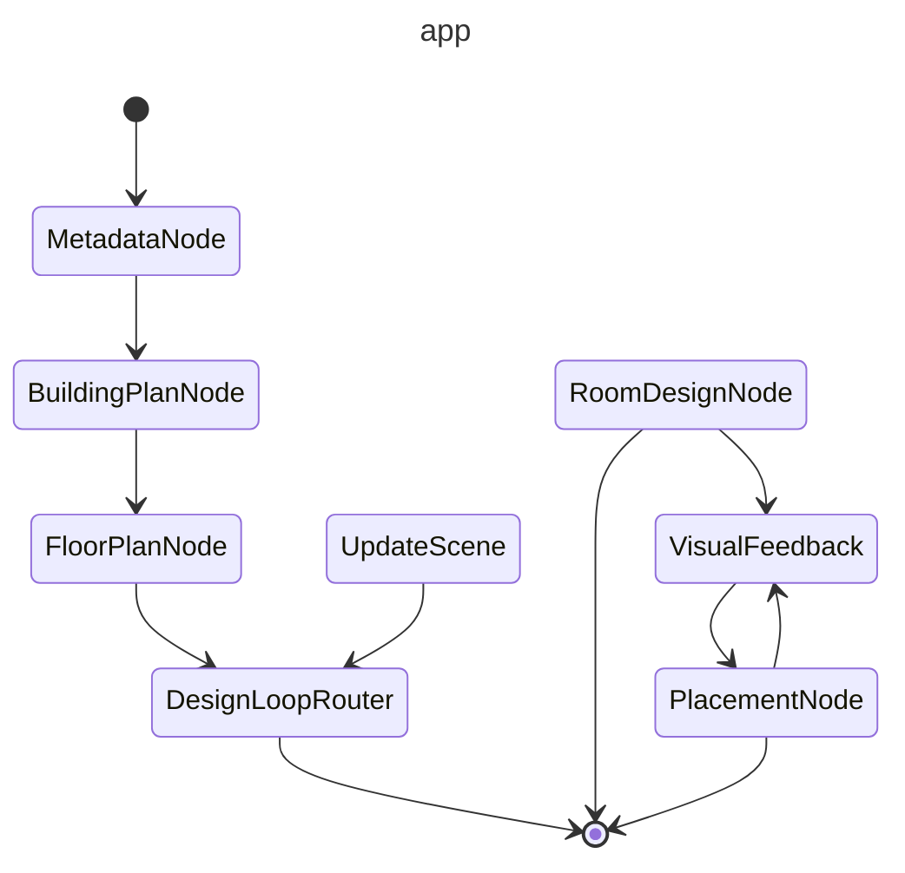

```mermaid
---
title: app
---
stateDiagram-v2
  [*] --> MetadataNode
  MetadataNode --> BuildingPlanNode
  BuildingPlanNode --> FloorPlanNode
  FloorPlanNode --> DesignLoopRouter
  DesignLoopRouter --> [*]
  RoomDesignNode --> VisualFeedback
  RoomDesignNode --> [*]
  UpdateScene --> DesignLoopRouter
  VisualFeedback --> PlacementNode
  PlacementNode --> VisualFeedback
  PlacementNode --> [*]
```