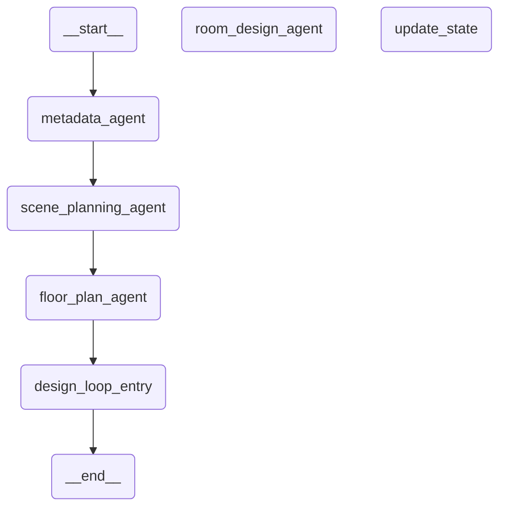

```mermaid
---
config:
  flowchart:
    curve: linear
---
graph TD;
 __start__(<p>__start__</p>)
 metadata_agent(metadata_agent)
 scene_planning_agent(scene_planning_agent)
 floor_plan_agent(floor_plan_agent)
 design_loop_entry(design_loop_entry)
 room_design_agent(room_design_agent)
 update_state(update_state)
 __end__(<p>__end__</p>)
 __start__ --> metadata_agent;
 floor_plan_agent --> design_loop_entry;
 metadata_agent --> scene_planning_agent;
 scene_planning_agent --> floor_plan_agent;
 design_loop_entry --> __end__;
 classDef default fill:#f2f0ff,line-height:1.2
 classDef first fill-opacity:0
 classDef last fill:#bfb6fc
```
