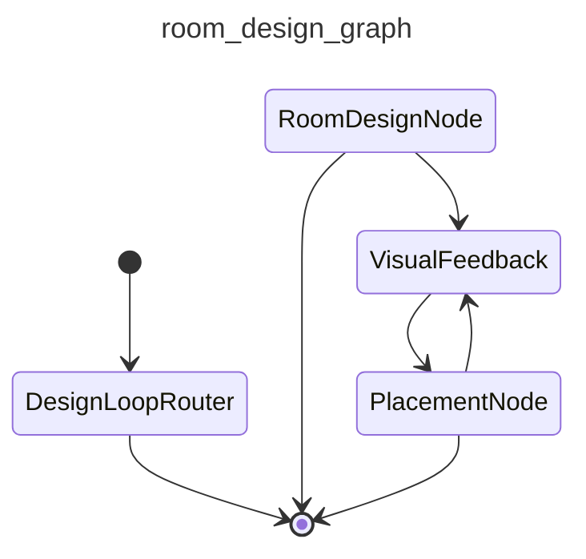

```mermaid
---
title: room_design_graph
---
stateDiagram-v2
  [*] --> DesignLoopRouter
  DesignLoopRouter --> [*]
  RoomDesignNode --> VisualFeedback
  RoomDesignNode --> [*]
  VisualFeedback --> PlacementNode
  PlacementNode --> VisualFeedback
  PlacementNode --> [*]
```